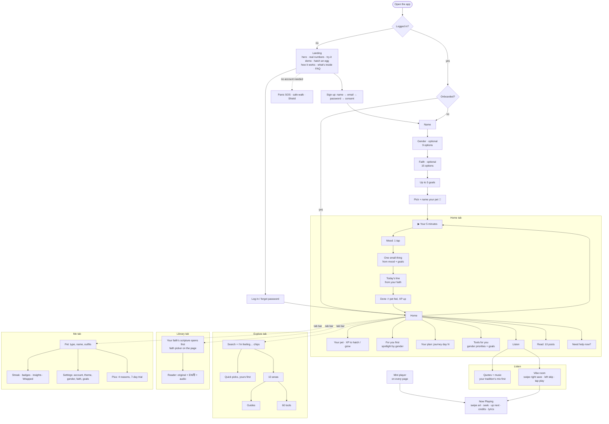

# App flow

Four tabs once you're in: **Home · Explore · Library · Me**. Everything else is one or two taps from one of them.

| Where | What lives there |
|---|---|
| Landing (logged out) | Hero, real numbers, no-account demo, pet egg, how it works, what's inside, promises, FAQ, sign up / log in |
| **Home** `#/` | 5-minute daily flow, your pet, spotlight, plan, tools for you, Listen, Read, today's wisdom (your faith), SOS |
| **Explore** `#/explore` | Search, need chips, quick picks, 10 areas → guides + tools |
| **Library** `#/library` | Gita, Ramayana, Guru Granth Sahib, Quran, Bible, Dhammapada — your faith's book first |
| **Me** `#/me` | Pet, streak, badges, insights, settings, Plus |
| Listen `#/listen` | Hands-free mixes: quote → music → next quote |
| Vibe room `#/listen/vibe` | Swipe deck of songs; saved songs row |
| Now Playing | Opens from the mini player on any page |
| Read `#/read` | Blog posts; `#/read/<slug>` for one post |
| Tools `#/tools/<id>` | Any of the 60 tools, with "up next" handoffs |

## What gender and faith change

Only the **order** and **defaults**. Nothing is ever hidden.

| You picked | What comes first |
|---|---|
| Woman / girl | Shield spotlight; safe-walk, cycle tracker, emergency card, relationship check |
| Trans woman | Shield spotlight; safe-walk, emergency card, relationship check, boundary scripts |
| Man / boy | Bro code spotlight; workout, boundary scripts, friend check-ins, urge surfer |
| Trans man | Bro code spotlight; workout, cycle tracker, safe-walk, boundary scripts |
| Non-binary, transgender / third gender, genderfluid / queer, self-described | "Safety, your way" spotlight; safe-walk, emergency card, journal, boundary scripts |
| Prefer not to say / skipped | Your goals decide |
| A faith | Its quotes on Home and in a Listen mix, its scripture opens first in the Library |
| Atheist / agnostic | Philosophy (Stoic, Taoist, Confucian) instead of scripture on Home |
| Every faith / spiritual / something else / prefer not to say | Every tradition, mixed |
