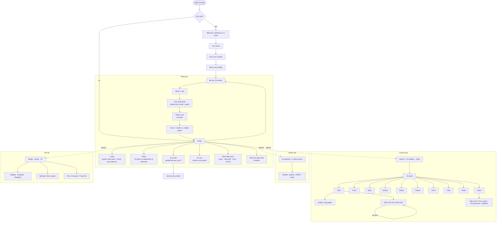

# App flow

Four tabs, always visible: **Today · Explore · Library · Me**. Everything else is one or two taps from one of them.

| Where | What lives there |
|---|---|
| **Today** `#/` | 5-minute daily flow, today's one task, Listen, Read, your plan, tools for your goals, SOS, why this app exists |
| **Explore** `#/explore` | Search, need chips, 10 areas → guides + tools |
| **Library** `#/library` | Gita, Ramayana, Guru Granth Sahib, Quran, Bible, Dhammapada |
| **Me** `#/me` | Buddy, streak, badges, insights, settings, Plus |
| Listen `#/listen` | Hands-free mixes: quote → music → next quote |
| Read `#/read` | Blog posts; `#/read/<slug>` for one post |
| Tools `#/tools/<id>` | Any of the 60 tools, with "up next" handoffs |
