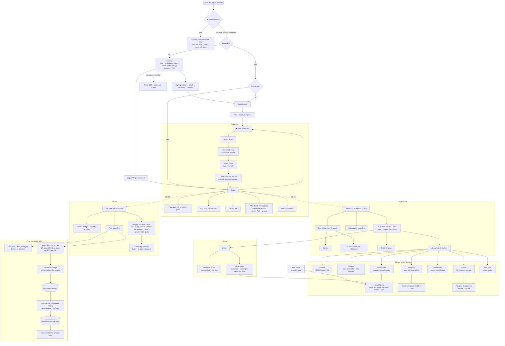

# App flow

Three tabs once you're in: **Today · Discover · Me**. The Library and Listen/Read live under Discover. Everything else is one or two taps from one of them.

| Where | What lives there |
|---|---|
| Landing (logged out) | Hero, no-account demo, how it works, pet egg, promises, FAQ, sign up / log in |
| **Today** `#/` | Your pet, the 5-minute daily flow, today's line (your faith), your plan once started, SOS |
| **Discover** `#/explore` | Search, need chips, five hub cards (Feel better, Study, Listen, Read, Books & scripture), quick tools, 10 areas → guides + tools |
| Library `#/library` (under Discover) | Hub of six shelves: school, college, exams, scripture, free books, audiobooks |
| School `#/library/school` | 1,141 NCERT textbooks, class 1–12, 23 languages, with chapter lists |
| College `#/library/college` | 8 streams: OpenStax, LibreTexts, MIT OCW, NPTEL, SWAYAM |
| Exams `#/library/exams` | 28 exams + 360 practice questions across 12 subjects |
| Scripture `#/library/faith` | Gita, Ramayana, Guru Granth Sahib, Quran, Bible, Dhammapada — your faith's book first |
| Free books `#/library/read` | Open Library + Project Gutenberg, read inside the app |
| Audiobooks `#/library/listen` | LibriVox, with chapters and 0.75×–2× speed |
| **Me** `#/me` | Pet, streak, badges, insights, settings (with sync status), Plus, delete my account |
| Listen `#/listen` | Hands-free mixes: quote → music → next quote |
| Music reels `#/listen/reels` | A feed of songs that plays itself; saved songs row |
| Now Playing | Opens from the mini player on any page |
| Read `#/read` | Blog posts; `#/read/<slug>` for one post |
| Tools `#/tools/<id>` | Any tool; collections open on a tab (`#/tools/one-line`); "goes well with this" footer |

Every external link opens in the in-app viewer, never a new tab. Every screen outside the three tabs has a back button in the top bar.

## What gender and faith change

Only the **order** and **defaults**. Nothing is ever hidden.

| You picked | What comes first |
|---|---|
| Woman / girl | Shield spotlight; safe-walk, cycle tracker, emergency card, relationship check |
| Trans woman | Shield spotlight; safe-walk, emergency card, relationship check, boundary scripts |
| Man / boy | Bro code spotlight; workout, boundary scripts, friend check-ins, urge surfer |
| Trans man | Bro code spotlight; workout, cycle tracker, safe-walk, boundary scripts |
| Non-binary, transgender / third gender, genderfluid / queer, self-described | "Safety, your way" spotlight; safe-walk, emergency card, journal, boundary scripts |
| Prefer not to say / skipped | Your goals decide |
| A faith | Its quotes on Home and in a Listen mix, its scripture opens first in the Library |
| Atheist / agnostic | Philosophy (Stoic, Taoist, Confucian) instead of scripture on Home |
| Every faith / spiritual / something else / prefer not to say | Every tradition, mixed |
